<p align="left">  </p>



## Code of the month:

```python
>>> eval((lambda:0).__code__.replace(co_consts=()))
```

## My Skills

<p align="center">
  <a href="https://github.com/eschan145">
    
  </a>
</p>

<a href="https://github.com/eschan145">
  
</a>
<a href="https://github.com/eschan145">
  
</a>

(There are at least four hundred commits untracked in private respositories)


## About Me

* I program in several languages, primarily C++. That would also include Python, C, Java, and definitely not JavaScript, which can go right to hell.

---

## Contact information

There are several ways to contact me.

 **SO**: eschan145

 **Discord**: eschan145, eschan145.alt, eschan145.alt2.

📧 **Email**: I'm avaliable with [esamuelchan@gmail.com](esamuelchan@gmail.com) or [ethan.samuel.chan@gmail.com](ethan.samuel.chan@gmail.com)


